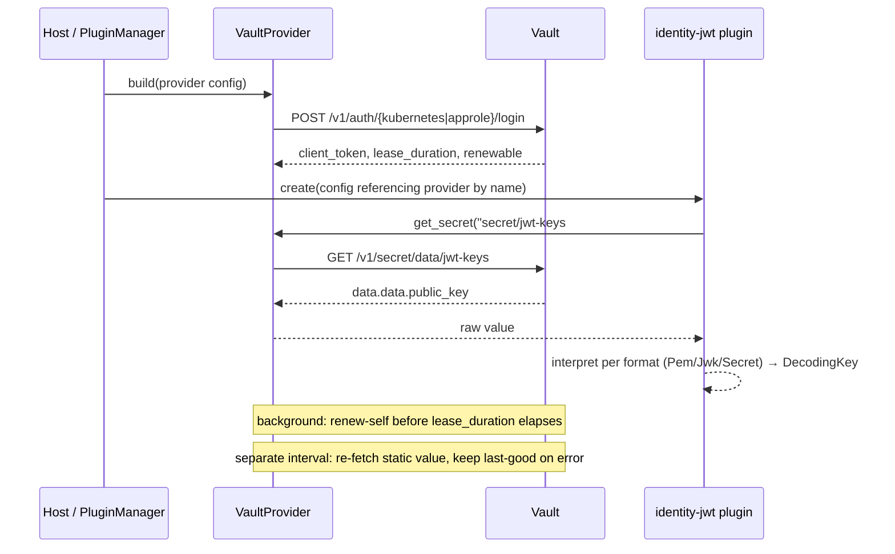

# Vault-backed `SecretProvider` (Use Case A: config-time secrets)

## Summary

Add a provider-agnostic `SecretProvider` trait plus a `kind()`-based factory/registry, and ship one implementation — `VaultProvider` — that resolves KV v2 secrets over Vault's HTTP API using a hand-written `reqwest` client (no SDK, no codegen). The first and only consumer in this slice is JWT decoding keys: `DecodingKeySource` gains a `Provider` variant. Initial resolution is fail-fast; after startup, a configurable refresh keeps the value current and falls back to the last-good value on error. Ships as an opt-in `secrets-vault` feature, out of `default`, in `full`. Runtime/per-request delegation (Use Case B), dynamic secrets, KV v1, writes, and codegen are explicitly out of scope.

---

## Problem Frame

CPEX plugin config sources secret material only inline or from local files. `DecodingKeySource` (`builtins/plugins/identity-jwt/src/config.rs:115-163`) offers `Pem`, `PemFile`, `Jwk`, `JwksUrl`, and `Secret` — none of them reach an external secret manager. Operators running Vault want config to say "resolve this from Vault" instead of holding the literal or a path on disk.

[#139](https://github.com/contextforge-org/cpex/issues/139) scopes the general answer: a `SecretProvider` trait that consumers depend on exclusively, with Vault and (later) Infisical as swappable implementations, gated behind Cargo features so a build with no secrets feature carries no provider-specific dependency. [#144](https://github.com/contextforge-org/cpex/issues/144) is the spike that closed the licensing and API-surface questions — Vault's HTTP interface is sufficient, a hand-written client beats an SDK or codegen, and the work splits into Use Case A (config-time secrets, this document) and Use Case B (runtime, per-request delegated credentials, explicitly deferred). This document is the requirements spec [that closing comment](https://github.com/contextforge-org/cpex/issues/144#issuecomment-5211146539) asked for.

The one load-bearing gap the codebase doesn't already answer: `PluginFactory::create()` (`crates/cpex-core/src/factory.rs`) receives only a plugin's own `&PluginConfig` — no shared-service context. `PdpFactory` and `SessionStoreFactory` sidestep this because they're consulted by the APL config visitor (`register_apl`, `crates/apl-cpex/src/register.rs`) at a point after plugin factories are already registered. A `SecretProvider` needs to exist *before* a plugin factory (e.g. `JwtIdentityFactory`) runs, since that factory's `create()` call is what needs to resolve `DecodingKeySource::Provider`. There is no existing seam for that. This spec states the requirement (provider construction must precede any plugin construction that references it) and flags the exact wiring mechanism as an open question — see Outstanding Questions — rather than inventing a `PluginManager`/trait change unilaterally.

---

## Actors

- A1. **Plugin config (consumer)** — `identity-jwt`'s `DecodingKeySource::Provider` variant, resolved at plugin construction/initialize time.
- A2. **SecretProvider registry (host-assembled)** — named provider instances, built ahead of any plugin factory that references one by name.
- A3. **`VaultProvider`** — the `reqwest`-based HTTP client instance, authenticated against one Vault mount, resolving KV v2 paths.
- A4. **Vault server** — the external secrets engine; not controlled by CPEX.
- A5. **Operator** — configures the Vault address, auth method and credentials, KV mount/paths, and refresh interval; owns Vault-side policies/roles.

---

## Key Flows

- F1. Startup resolution (fail-fast)
  - **Trigger:** Gateway/host constructs a `VaultProvider` and a plugin (e.g. `identity-jwt`) whose config references it by name.
  - **Actors:** A2, A3, A4, A1
  - **Steps:** `VaultProvider` logs in (Kubernetes or AppRole) → gets `client_token` + `lease_duration` + `renewable` → the consumer calls `get_secret(reference)` → `VaultProvider` issues `GET /v1/<mount>/data/<path>` → extracts `field` from `data.data` → returns the raw value → consumer interprets it per its own `format` (PEM/JWK/HMAC) and builds its runtime key.
  - **Outcome:** On any failure in this chain (login, KV read, missing field, malformed value), provider or plugin construction fails and the gateway does not start serving with a missing key.
  - **Covered by:** R1, R5, R6, R13

- F2. Vault auth-token renewal (background)
  - **Trigger:** The issued token's `lease_duration` approaches expiry.
  - **Actors:** A3, A4
  - **Steps:** A background task calls `POST /v1/auth/token/renew-self` before expiry (renewable tokens) or re-runs the original login call (non-renewable tokens). A subsequent KV read that gets `403` because the token already expired triggers an out-of-schedule re-login rather than a hard failure.
  - **Outcome:** The provider's Vault session survives token TTL without a request-path re-auth, and a missed renewal window degrades to "re-login on next use," not to a stuck-broken provider.
  - **Covered by:** R11, R12

- F3. Static-secret refresh (soft-fail)
  - **Trigger:** A configurable interval elapses (independent of F2 — KV v2 static reads carry `lease_duration: 0`, so there is no lease to drive this off of).
  - **Actors:** A3, A4, A1
  - **Steps:** `VaultProvider` re-issues the same `get_secret` call. On success, the new value replaces the cached one. On failure (transport error, Vault error envelope, missing/malformed field), the provider logs/emits a metric and keeps serving the last-good value.
  - **Outcome:** A transient Vault outage after startup degrades to "serving a possibly-stale key," never to "serving no key" — matching the `JwksUrl` soft-fail precedent (`identity-jwt/src/resolver.rs:378-385`).
  - **Covered by:** R14, R15

---

## Requirements

**Trait and registry**
- R1. `cpex-core` defines a provider-agnostic `SecretProvider` trait: `async fn get_secret(&self, reference: &str) -> Result<Zeroizing<String>, SecretError>`, per the return type your own [Use Case A sketch](https://github.com/contextforge-org/cpex/issues/144#issuecomment-5184222028) proposed. Consumers depend only on this trait — swapping the configured provider (Vault → Infisical, later) requires no consumer code change, per [#139](https://github.com/contextforge-org/cpex/issues/139)'s acceptance criteria. Note this is a new dependency (`zeroize`) the codebase doesn't currently carry — `ClientSecretSource::resolve` returns a plain `String` (`delegator-oauth/src/config.rs:110`) — so adopting `Zeroizing` here is a deliberate step up in secret-handling posture, not a continuation of existing practice; see Outstanding Questions.
- R2. `SecretProviderFactory` (`fn kind(&self) -> &str`, `fn build(&self, config: &serde_yaml::Value) -> Result<Arc<dyn SecretProvider>, Box<dyn Error + Send + Sync>>`), mirroring `PdpFactory` (`crates/apl-core/src/step.rs:364-377`) and `SessionStoreFactory` (`crates/apl-cpex/src/session_store.rs:100-111`). `VaultProviderFactory` is the only builtin implementation shipped in this slice.
- R3. Providers are named. Config declares one or more provider blocks (kind-tagged, analogous to `global.apl.pdp[]` / `global.apl.session_store`), each with an operator-chosen name; consumers reference a provider by that name (e.g. `DecodingKeySource::Provider { provider: "vault-prod", .. }`) rather than repeating connection details inline.
- R4. Provider construction is required to complete, for every provider referenced by name in config, before any plugin factory that references one runs. This spec fixes the requirement; the wiring mechanism that guarantees the order is deferred — see Outstanding Questions.

**Reference shape and consumer interpretation**
- R5. Vault reference grammar: `<mount>/<path>#<field>`, addressing a KV v2 mount, a secret path under it, and a field name inside that version's `data.data` object. `VaultProvider::get_secret` builds `GET /v1/<mount>/data/<path>` and extracts `field` from the response; an absent path, absent field, or non-string field value is a `SecretError`, not an empty result.
- R6. `DecodingKeySource` gains `Provider { provider: String, reference: String, format: KeyFormat }`, with `KeyFormat ∈ { Pem, Jwk, Secret }` mirroring the three static variants already handled by `DecodingKeySource::build`/`build_async` (`config.rs:198-216`, `237+`). The provider returns the raw field value as a string; `identity-jwt` — not `VaultProvider` — interprets it per `format`. This keeps format interpretation on the consumer side, which is what makes the provider swappable per R1.

**Vault HTTP surface**
- R7. KV v2 reads only: `GET /v1/<mount>/data/<path>[?version=N]`. No writes, no KV v1 (`GET /v1/<mount>/<path>`, no `/data/` segment), no dynamic-secret endpoints (`/v1/database/creds/...` etc.).
- R8. A minimal hand-written client using `reqwest` with `rustls-tls` (matching `identity-jwt` / `delegator-oauth`'s existing dependency, `identity-jwt/Cargo.toml:64-67`), implementing exactly: KV v2 read, Kubernetes login, AppRole login, token renew-self. No generated client, no `vaultrs` or other Vault SDK crate — consistent with the spike's licensing conclusion (BUSL-licensed official SDKs stay out of the graph).
- R9. Vault's error envelope (`{"errors": [...]}`) is surfaced as a distinct `SecretError` variant carrying the message list, separate from transport-level failures (connect/timeout/DNS) and from a `403` on an established session (treated as "re-authenticate," not as "the secret doesn't exist" — see R12).
- R10. The Vault address must be `https://` by default; a plaintext endpoint requires an explicit `insecure_http: true` opt-out, mirroring `identity-jwt`'s `JwksUrl.insecure_http` / `require_https` (`config.rs:137-141`, `245`) — for the same reason: an unauthenticated network path to a secret/auth endpoint lets an on-path attacker read or substitute the material a token-verification or credential path then trusts.

**Auth**
- R11. Two auth methods, explicitly selected per provider config, with no default: **Kubernetes** (`POST /v1/auth/kubernetes/login` with `role` + the pod's mounted service-account JWT) and **AppRole** (`POST /v1/auth/approle/login` with `role_id` + `secret_id`). `secret_id` is sourced via the same three-way `EnvVar { name } | File { path } | Literal { secret }` shape as `delegator-oauth`'s `ClientSecretSource` (`delegator-oauth/src/config.rs:81-85`).
- R12. The provider tracks `auth.lease_duration` and `auth.renewable` from the login response. Renewable tokens are renewed via `POST /v1/auth/token/renew-self` on a background schedule that completes before expiry (exact fraction-of-TTL/jitter is an implementation detail, not fixed here). Non-renewable tokens are re-obtained via a fresh login before expiry instead of renewed. A `403` on a KV read triggers an out-of-schedule re-login rather than surfacing as a permanent failure.

**Refresh and failure semantics for the static secret**
- R13. **Fail-fast initial resolution.** If the first `get_secret` call (at provider or consumer construction) fails for any reason — auth failure, KV read failure, missing/malformed field — construction fails and the gateway does not start with that key missing. This is a deliberate departure from `identity-jwt`'s `JwksUrl`, which tolerates initial-fetch failure and boots into a soft `auth.jwks_unavailable` state (`resolver.rs`'s `initialize()`, ~lines 279-330): a `JwksUrl` issuer can still receive a later successful background fetch and multiple issuers are independent, whereas a single Vault-sourced static key has no such degraded-but-serving state — there is exactly one key and no fallback path once construction has proceeded past it.
- R14. **After startup**, a configurable refresh interval re-runs `get_secret`. On failure, the provider logs/emits a metric and retains the last-good value — matching the `JwksUrl` background-refresh soft-fail (`resolver.rs:378-385`) — rather than serving no key or erroring the request path.
- R15. This refresh is **time-interval-driven, not lease-driven**: KV v2 static reads return `lease_duration: 0` (Vault issues no lease for them), so there is nothing to refresh against. The refresh interval is a provider-level config field, independent of the auth-token renewal lifecycle in R12 — one governs "is the cached value still current," the other governs "is the Vault session I'm reading it with still valid."

**First consumer and feature-gating**
- R16. JWT decoding keys (`DecodingKeySource::Provider`, R6) is the only consumer built in this slice.
- R17. Ship a new crate `builtins/plugins/secrets-vault` (package `cpex-plugin-secrets-vault`, matching the `cpex-plugin-<name>` convention used by `identity-jwt`, `delegator-oauth`, etc.), wired into `crates/cpex-builtins/Cargo.toml` as `dep:`-optional, excluded from `default`, included in `full` — mirroring `valkey`'s feature-flag mechanics (`secrets-vault = ["dep:cpex-plugin-secrets-vault"]`; add to `full = ["default", "valkey", "secrets-vault"]`; cf. `Cargo.toml:42,46`) — note `valkey`'s own optional dependency is `cpex-session-valkey`, a session-store crate that doesn't itself follow the `cpex-plugin-<name>` convention cited above, though the `dep:`-optional / excluded-from-`default` / included-in-`full` mechanics match exactly.
- R18. No new `deny.toml` entries are required: `reqwest` + `rustls-tls` are already in the dependency graph via `identity-jwt`/`delegator-oauth`, and both licenses (Apache-2.0/MIT) are already on the allow-list (`deny.toml:33-49`). If a future dependency needs a new entry, that is called out explicitly at review time, per [#139](https://github.com/contextforge-org/cpex/issues/139)'s licensing constraint.
- R19. The Vault HTTP/auth client (login, renew, KV read) lives as a private module inside `cpex-plugin-secrets-vault` with a narrow internal boundary (e.g. a `VaultClient` with `login`, `renew`, `read_kv2` methods) — not extracted to a shared crate. This slice does not generalize the client beyond what Use Case A needs; a future Use Case B delegator can depend on or fork this boundary without this spec pre-designing that reuse.

---

## Acceptance Examples

- AE1. **Covers R1, R6.** Given a `DecodingKeySource::Provider` referencing a configured Vault provider by name, when the JWT plugin initializes, the key is fetched via `SecretProvider::get_secret` and used to verify tokens — matching [#139](https://github.com/contextforge-org/cpex/issues/139)'s stated acceptance scenario.
- AE2. **Covers R1.** Given `cpex-builtins` built without the `secrets-vault` feature, no Vault-specific crate appears in the dependency graph — matching [#139](https://github.com/contextforge-org/cpex/issues/139)'s "no secrets feature, no dependency" scenario.
- AE3. **Covers R5.** Given a reference `secret/jwt-keys#public_key` and a KV v2 secret at `secret/data/jwt-keys` with a `public_key` field, `get_secret` returns that field's raw string value.
- AE4. **Covers R7.** Given a reference addressing a KV v1-style path or a dynamic-secret path, the provider rejects it at config-validation or first-use time rather than silently attempting an unsupported call.
- AE5. **Covers R11.** Given a provider config with no `auth.method` set, config validation fails — there is no default auth method.
- AE6. **Covers R13.** Given Vault is unreachable at startup, plugin/provider construction fails and the gateway does not start with that JWT issuer active.
- AE7. **Covers R14, R15.** Given a successful initial fetch followed by Vault becoming unreachable at the next refresh tick, the provider keeps serving the previously-fetched key and emits a refresh-failure signal, rather than clearing the key or crashing.
- AE8. **Covers R12.** Given a renewable token nearing `lease_duration` expiry, the provider renews it via `renew-self` before expiry without any request-path latency impact.
- AE9. **Covers R17.** Given a `full` feature build, `cpex-plugin-secrets-vault` is present; given a `default` feature build, it is absent.

---

## Success Criteria

- A JWT issuer's decoding key can be sourced from Vault KV v2 with no code change to the JWT plugin's verification path — only its config.
- A build with no `secrets-vault` feature carries no Vault-specific dependency, and `cargo deny` on the default graph is unaffected.
- Swapping the named provider's `kind` (Vault → a future Infisical provider) requires no change to `DecodingKeySource::Provider`'s consumer-side interpretation logic.
- A Vault outage after startup degrades to a stale-but-present key, never to no key; a Vault outage at startup fails loudly, never to a silently-missing key.
- The next planning step can proceed without inventing product behavior: auth method selection, refresh vs. lease semantics, and fail-fast-vs-soft-fail posture are decided here. The provider-construction-ordering seam is the one genuinely open item, called out explicitly below.

---

## Scope Boundaries

- **Use Case B (runtime, per-request delegation)** — the `delegator/vault` plugin, `TokenDelegateHook` integration, Vault JWT/OIDC auth, and dynamic secrets (`/v1/database/creds/...` etc.) described in [#144](https://github.com/contextforge-org/cpex/issues/144)'s spike comments. Explicitly deferred; R19 keeps a boundary it can build against.
- **KV v1** and **secret writes** — not addressed; this slice is read-only KV v2.
- **Vault OpenAPI-driven codegen** — rejected in the spike; not revisited here.
- **Generalized multi-field/multi-header credential injection** — `RawDelegatedToken` stays bearer-only; unrelated to this slice regardless, since Use Case A doesn't touch delegation at all.
- **Infisical implementation** — R1's trait must not preclude it, but building it is separate work.
- **Vault version pinning / compatibility testing strategy** — the spike raised this (Vault does not promise `v1` back-compat) but resolving it (pin a version range? integration-test against a specific Vault container tag?) is left to planning; see Outstanding Questions.

---

## Key Decisions

- **Hand-written client, no SDK, no codegen** — carried over from the spike: minimal surface area against Vault's no-back-compat-promise risk, and avoids the BUSL-licensed official SDKs entirely (R8, R18).
- **Provider returns raw strings; format interpretation stays consumer-side** — the alternative (provider parses PEM/JWK/HMAC itself) would make `SecretProvider` JWT-shaped and break provider-agnosticism the moment a second consumer with different material shows up (R6).
- **Fail-fast on initial resolution, soft-fail-with-last-good on refresh** — a deliberate asymmetry, contrasting with `JwksUrl`'s soft-start: a static single-key source has no degraded-but-serving state to fall back into on the very first fetch, but once a good value has been served, availability wins over freshness for subsequent refreshes (R13, R14).
- **Time-interval refresh, decoupled from auth-token renewal** — KV v2 static reads carry no lease (`lease_duration: 0`), so refresh cannot be lease-driven; the Vault session's own TTL/`renewable` flag is a separate lifecycle governing whether the provider can talk to Vault at all, not whether the cached value is current (R15).
- **Kubernetes and AppRole only, explicitly selected, no default** — matches deployment reality (k8s-native vs. not) without guessing; JWT/OIDC auth is deferred to Use Case B, where the caller's own identity is what's being presented (R11).
- **`secrets-vault` opt-in feature** — mirrors `valkey`'s `dep:`-optional / excluded-from-`default` / included-in-`full` pattern exactly, so non-Vault deployments carry nothing (R17).
- **No shared Vault-client crate extracted yet** — refactor-then-reuse, same call as the valkey doc's R14: extract only when Use Case B is actually being built (R19).

---

## Dependencies / Assumptions

- Vault is reachable over HTTPS from the gateway process; TLS trust (system CA store vs. custom CA) is an implementation detail, not fixed here.
- The operator has already configured the relevant Vault-side auth method (Kubernetes role bound to the gateway's service account, or an AppRole) and the KV v2 mount/policy granting read access to the referenced path.
- `reqwest` + `rustls-tls` remain the workspace's HTTP-client choice (already true for `identity-jwt` and `delegator-oauth`); no new TLS stack is introduced.
- Use Case B, if and when built, can depend on or fork the internal `VaultClient` boundary (R19) without this spec having pre-designed that reuse.

---

## Outstanding Questions

### Deferred to Planning

- [Affects R4][Technical] **Provider-construction-ordering seam.** `PluginFactory::create()` (`crates/cpex-core/src/factory.rs`) receives only a plugin's own config — no shared-service context — so there is no existing mechanism for a plugin factory to obtain a named `Arc<dyn SecretProvider>` at construction time. `PdpFactory`/`SessionStoreFactory` avoid this because they're consulted by the APL visitor after plugin factories are already registered, which is the wrong order for a provider a plugin factory itself needs. Planning must choose: host-code-assembled (build providers first, capture them in the plugin factory's own constructor, mirroring how `AplOptions` is assembled today), or a new `PluginManager`-level registry consulted before `load_config()`, or something else. *(Raised by feasibility — same class of gap as the valkey doc's Q1.)*
- [Affects R3][Technical] Where the provider config block lives in the unified-config schema (a new top-level `global.secrets:` section vs. something else), and whether it's parsed by the same visitor infrastructure as `global.apl.*` or by a separate pre-pass.
- [Affects R12][Technical] Exact renewal schedule (fraction of `lease_duration`, jitter, retry/backoff on a failed renewal attempt) — left as an implementation detail here but needs a concrete value before implementation.
- [Affects R8, R10][Needs research] Vault version pinning or compatibility-testing approach, given Vault's explicit no-back-compat promise on the `v1` prefix (raised in the original spike, [#144](https://github.com/contextforge-org/cpex/issues/144), and not resolved by the closing comment's scoping).
- [Affects R9][Technical] Full enumeration of `SecretError` variants (transport, Vault error-envelope, auth-expired/403, field-not-found, malformed-value) and whether any of these should be distinguishable to the operator via metrics/logs beyond a single "resolution failed" signal.
- [Affects R1, R11][Security] `Zeroizing<String>` (R1) covers the value `SecretProvider::get_secret` returns, but the credentials used to *obtain* that value — `secret_id` (AppRole), the Kubernetes service-account JWT, the issued Vault `client_token` — have no equivalent treatment specified here, and `delegator-oauth`'s `ClientSecretSource` carries no `zeroize` dependency today (`delegator-oauth/src/config.rs:81-120`). Planning should decide whether zeroization is adopted consistently across the new Vault code path (secret_id, client_token, and the returned secret) or only where R1 already commits to it — a partial adoption would be a gap disguised as a decision. *(Raised by security.)*
