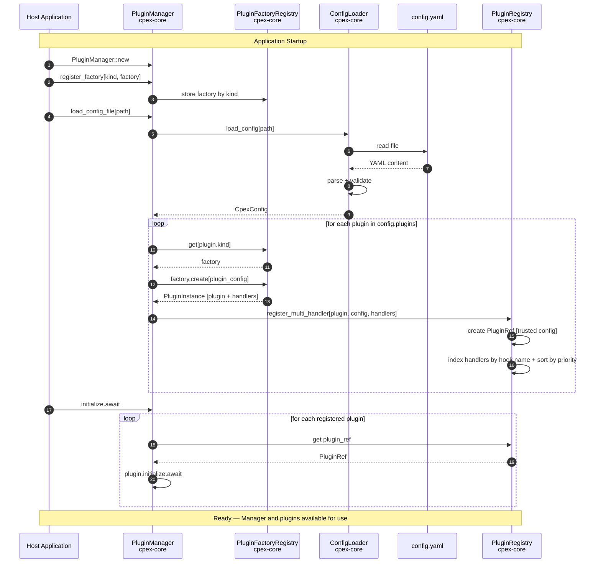
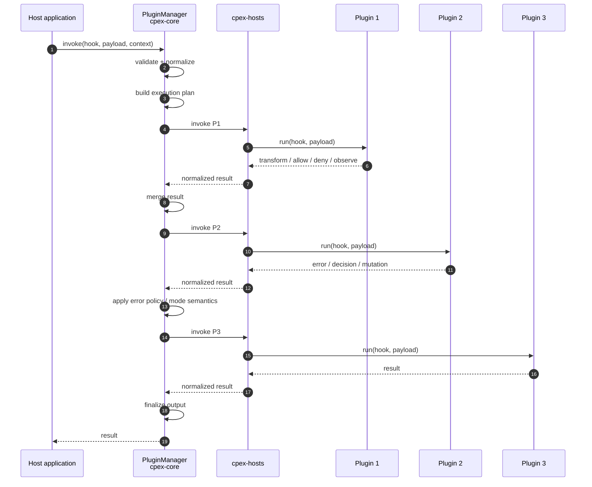

## CPEX Architecture Overview

The CPEX plugin framework follows a two-phase lifecycle: **bootstrap** (startup) and **execution** (runtime). At application startup, the host creates a `PluginManager`, registers plugin factories for each supported `kind`, and loads a YAML config file. The config loader parses and validates the file, then the manager uses the factories to instantiate each declared plugin and registers them into the `PluginRegistry` (sorted by priority and indexed by hook name). After calling `initialize()`, the manager is ready and can be shared across the application. At runtime, hook call sites simply invoke the manager with a payload and routing metadata; the manager resolves which plugins apply (via routes, policy groups, and tags), runs them through an execution pipeline, and returns a result. The diagrams and code sketch below illustrate both phases.

### CPEX Bootstrap



### CPEX Plugin Execution Flow (simplified)



#### Code Sketch

```rust
// ---------------------------------------------------------------------------
// Application startup — build and initialize the manager once
// ---------------------------------------------------------------------------

async fn bootstrap() -> PluginManager {
    let mut mgr = PluginManager::default();

    // Register factories so the manager knows how to create each plugin kind
    mgr.register_factory("builtin/identity", Box::new(IdentityFactory));
    mgr.register_factory("builtin/pii", Box::new(PiiGuardFactory));
    mgr.register_factory("builtin/audit", Box::new(AuditLoggerFactory));

    // Load config — parses YAML, instantiates plugins via factories,
    // registers them into the PluginRegistry sorted by priority
    mgr.load_config_file(Path::new("plugins.yaml")).unwrap();

    // Initialize all plugins (open connections, warm caches, etc.)
    mgr.initialize().await.unwrap();

    mgr
}

// ---------------------------------------------------------------------------
// Hook call sites — invoke the manager wherever hooks fire
// ---------------------------------------------------------------------------

async fn handle_tool_call(mgr: &PluginManager, tool: &str, user: &str, args: &str) {
    let payload = ToolInvokePayload {
        tool_name: tool.into(),
        user: user.into(),
        arguments: args.into(),
    };

    // Extensions carry routing metadata (entity type, name, tags)
    let extensions = Extensions {
        meta: Some(Arc::new(MetaExtension {
            entity_type: Some("tool".into()),
            entity_name: Some(tool.into()),
            ..Default::default()
        })),
        ..Default::default()
    };

    // Pre-invoke — the manager resolves which plugins fire for this
    // tool, runs the 5-phase pipeline, and returns the result
    let (result, bg) = mgr.invoke::<ToolPreInvoke>(payload.clone(), extensions.clone(), None).await;

    if !result.continue_processing {
        // A plugin denied the call — surface the violation
        let v = result.violation.unwrap();
        eprintln!("Denied by '{}': {}", v.plugin_name.unwrap_or_default(), v.reason);
        bg.wait_for_background_tasks().await;
        return;
    }

    // ... execute the actual tool ...

    // Post-invoke — threads the context table from pre-invoke
    let (_, bg) = mgr.invoke::<ToolPostInvoke>(payload, extensions, Some(result.context_table)).await;
    bg.wait_for_background_tasks().await;
}
```